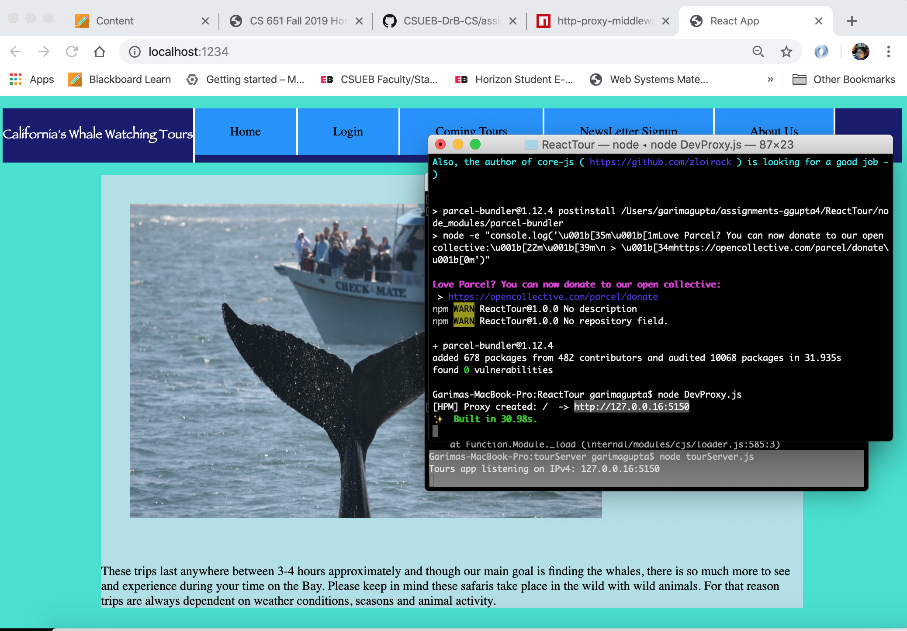
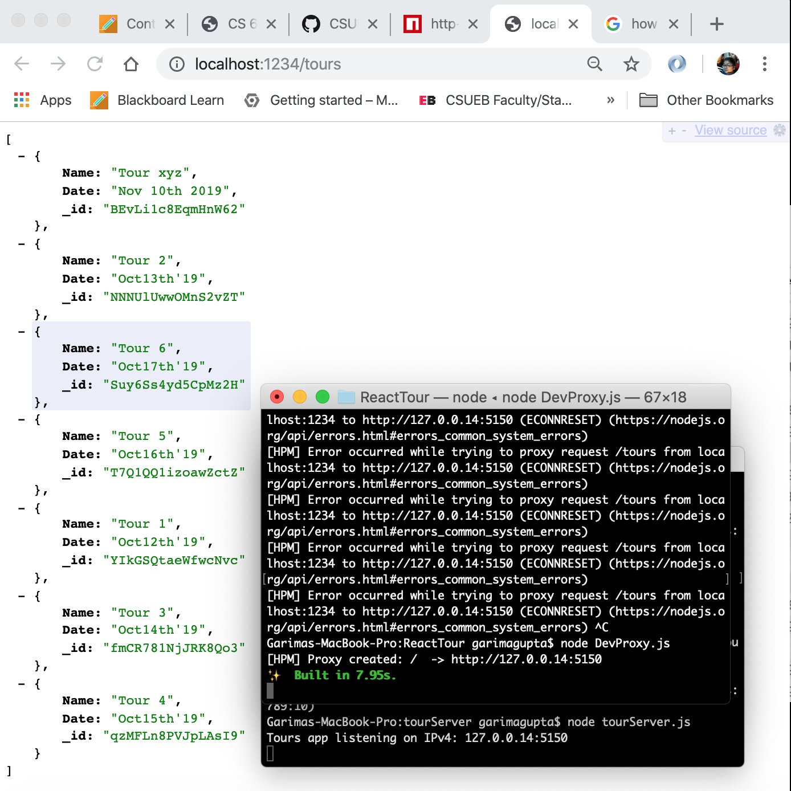
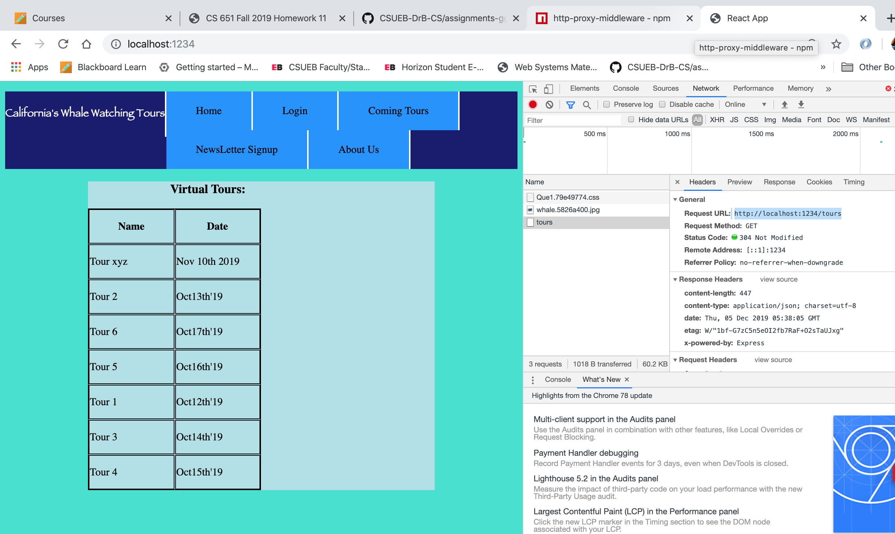
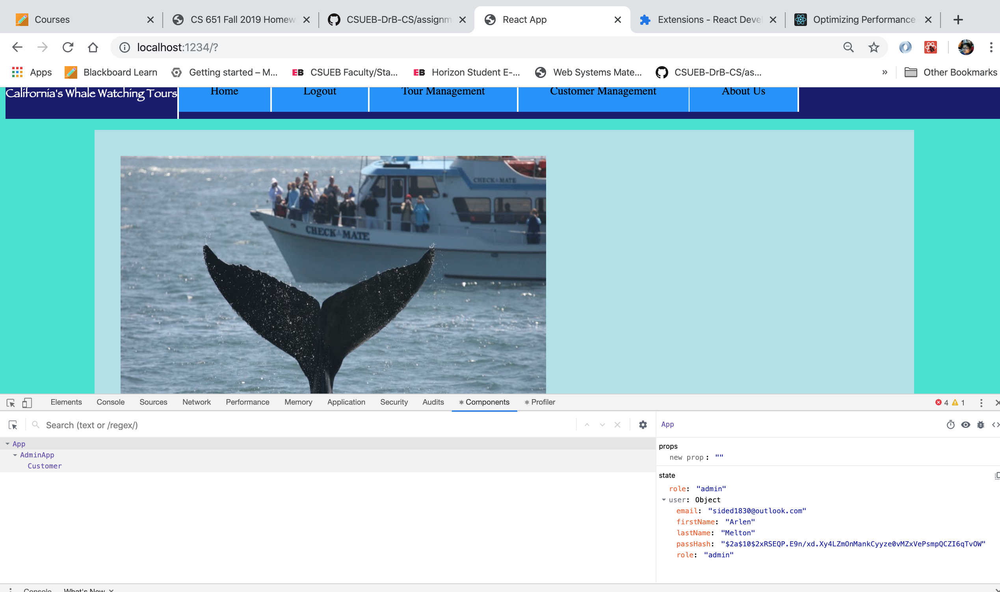
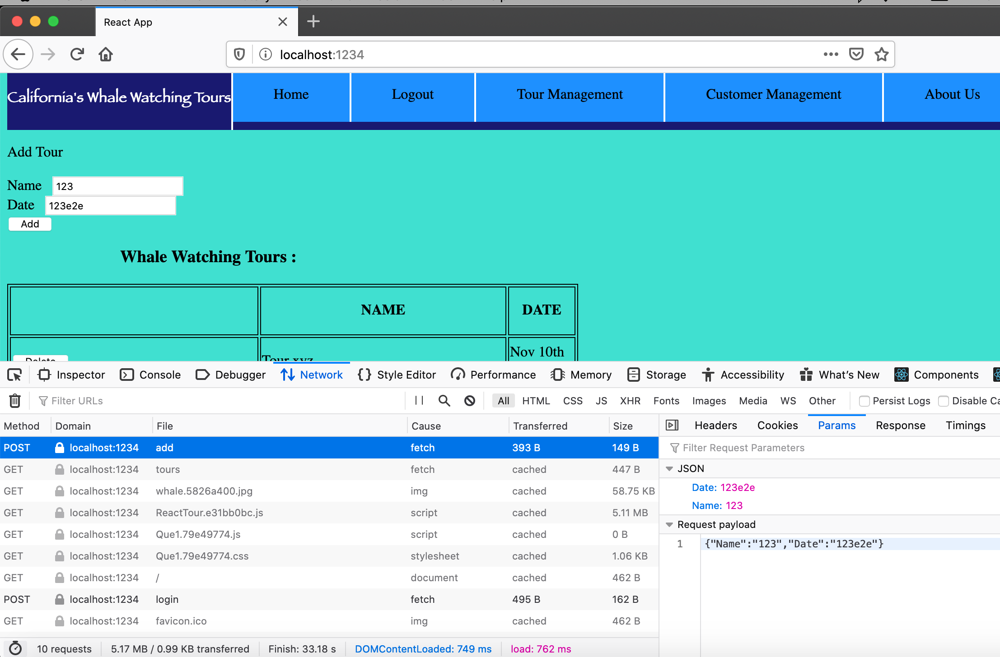
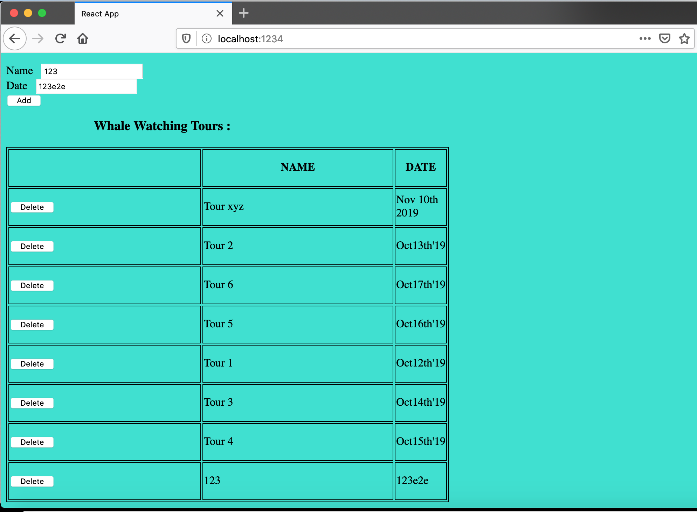
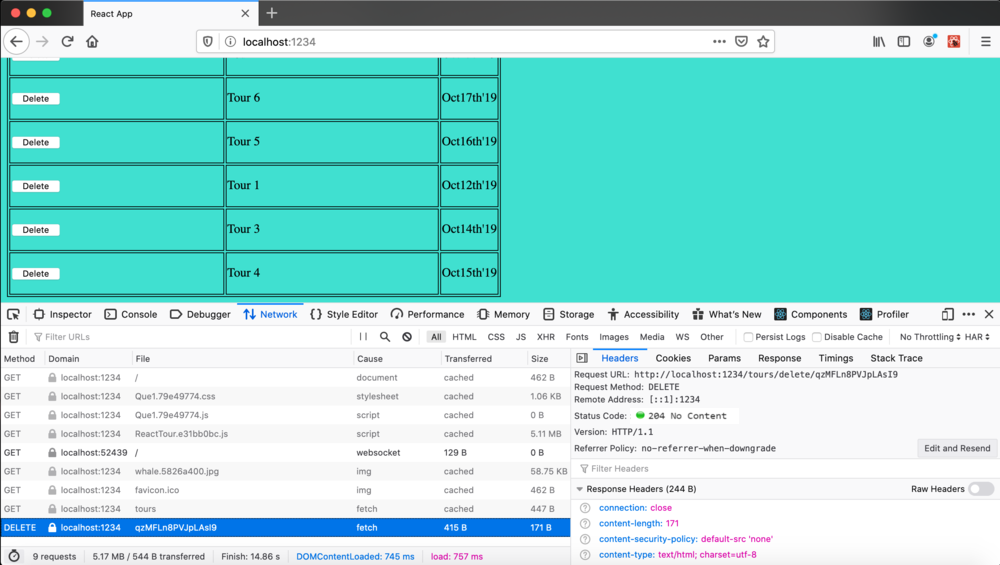

**Student Name**:  Garima Gupta

**NetID**: mm6326

# Assignment Outline for CS651


# Homework #10 Solutions

# Question 1
## a)
Dev Test: 


## (b)
Proxy Test: 

dev server/proxy code
```Javascript
const Bundler = require('parcel-bundler');
const express = require('express');
const proxy = require('http-proxy-middleware');
const app = express();
// Paths we want to forward to the app server
const forward = ['/tours', '/login', '/logout'];
app.use(forward, proxy({target: 'http://127.0.0.14:5150'}));
const bundler = new Bundler('./index.html');
app.use(bundler.middleware());
app.listen(1234);

```

# Question 2 :

## (a)
Updated Tours Component
```Javascript
componentDidMount() {
    let that = this;
    fetch("/tours")
      .then(function(response){
            if(response.ok){
                return response.json();
            } else{
                let info =`Status Code: ${response.status}, ${response.statusText}`;
                console.log('response ',response);
                return Promise.reject(info);
            }
        })
        .then(function(tours){
            that.setState({
                isLoaded:true,
                tours:tours
            });
            console.log('tours ',tours);
        })
        .catch(function(msg){
            console.log("Something bad "+msg);
        })
  }
```

## (b)
Tour Test: 


# Question 3
## a)
Login via Server: 

## b)
Login Handler code
```Javascript
signIn() {
   let that = this;
    console.log("Button pressed");

    if(this.state.email === "sided1830@outlook.com"){
        console.log('admin');
        console.log(this.state);
        this.props.OnSucces("admin",{email: this.state.email, password: this.state.password});
    }
    else if(this.state.email === "cust@email.org"){
        console.log('customer');
        this.props.OnSucces("customer",{email: this.state.email, password: this.state.password});
    }
    else {
        console.log('guest');
        this.props.OnSucces("guest",{email: this.state.email, password: this.state.password});
    }
    fetch('/login',{
        method:'POST',
        headers: {
            "Content-type":"application/json"
        },
        body: JSON.stringify({
            email: this.state.email,
            password: this.state.password
        })
    }).then(function(response){
        if(response.ok){
            return response.json();
        } else{
            let info =`Status Code: ${response.status}, ${response.statusText}`;
            console.log('response ',response);
            return Promise.reject(info);
        }
        console.log(response.json());
        return response.json();
    }).then(function(Info){
        console.log('Info',Info);
        that.props.OnSucces(Info.role,Info)
    })
}

```

## c)
Logout Handler Code
```Javascript
signOut() {
  let that = this;
fetch('/logout')
.then(function(response){
     if(response.ok){
         return response.json();
     } else{
         let info =`Status Code: ${response.status}, ${response.statusText}`;
         console.log('response ',response);
         return Promise.reject(info);
     }
 })
 .then(function(Info){
   that.props.handleLogout("guest",null);
 })
 .catch(function(msg){
     console.log("Something bad "+msg);
 })
}
```

# Question 4
## a)
Send tour to server: 
## b)
Update the List of Tours: 
## c)
Show Updated Code
```Javascript
addData() {
  fetch('/tours/add', {
    method: 'POST',
    headers: { 'Content-Type': 'application/json' },
    body: JSON.stringify({
      "Name": this.state.Name,
      "Date": this.state.Date
    })
  }).then((response) => {
    console.log("response: ", response);
  }).then((data) => {
    console.log(data);
  }).catch(function (error) {
    console.log("Error while adding tour...", error);
  });
}

```

# Question 5
## a)
Delete Request to Server: 

## b)
Update Tour Info
```JSON
{"Name":"Tour xyz","Date":"Nov 10th 2019","_id":"BEvLi1c8EqmHnW62"}
{"Name":"Tour 2","Date":"Oct13th'19","_id":"NNNUlUwwOMnS2vZT"}
{"Name":"Tour 6","Date":"Oct17th'19","_id":"Suy6Ss4yd5CpMz2H"}
{"Name":"Tour 5","Date":"Oct16th'19","_id":"T7Q1QQ1izoawZctZ"}
{"Name":"Tour 1","Date":"Oct12th'19","_id":"YIkGSQtaeWfwcNvc"}
{"Name":"Tour 3","Date":"Oct14th'19","_id":"fmCR781NjJRK8Qo3"}
{"Name":"Tour 4","Date":"Oct15th'19","_id":"qzMFLn8PVJpLAsI9"}

```
Show Updated Code
```Javascript
deleteData(i) {
  const updatedToursdata = this.state.fetchData;
  let deleteTour;
  deleteTour = updatedToursdata[i];
  fetch("/tours/delete/" + deleteTour._id, {
    method: 'DELETE'
  }).then((response) => {
    console.log("response:", response);
  }).then((data) => {
    updatedToursdata.splice(i, 1);
  })

  // updatedToursdata.splice(index, 1);
  this.setState({
    toursData: updatedToursdata,
  })

}

```
